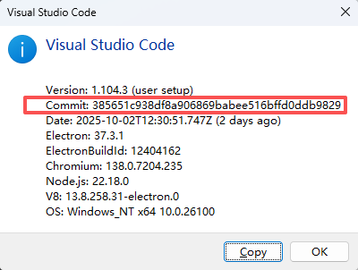
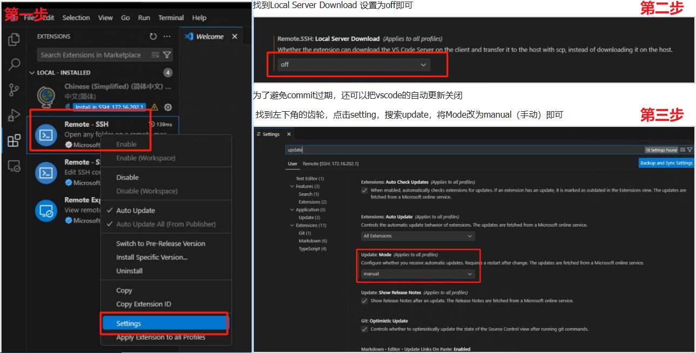

# 仓库功能描述：
ubuntu18.04的系统中，vscode远程连接服务器时，提示glibc版本过低，无法连接。
本项目通过编译一个较新的glibc版本，并配置vscode远程连接时使用该版本的glibc，从而解决该问题。

# 过程中参考了以下链接：
https://blog.csdn.net/Mark_md/article/details/110879073
https://blog.csdn.net/tardisc/article/details/148340159
https://www.jb51.net/server/329015f9n.htm
https://blog.csdn.net/fedorayang/article/details/136318719
https://www.jb51.net/server/329015f9n.htm

# 前置配置：
（一定注意）修改vscode_remote_setup.sh中的VSCODE_COMMIT_ID变量为你当前vscode的版本号对应的commit id

需要关闭vscode的自动更新以及一些自动下载功能，不然之后配置的文件可能会被覆盖：

# 使用方法：
0. 解压缩该项目到一个文件夹下，cd到这个目录
1. 保证网络通畅
2. 运行 `bash vscode_remote_setup.sh`
3. 查看输出日志，确认没有报错
4. 根据输出日志相应修改~/.bashrc
5. 运行 `bash vscode_remote_post_setup.sh`
6. 最好重新开一个终端，保证touch的临时文件生效

# 不成功的常见原因：
1. 网络不通畅（注意看两个sh文件运行过程中是否报错了）
2. 没有启动ssh服务
3. 没有正确修改~/.bashrc
4. 没有重新开一个终端（需要生成一个文件来欺骗vscode使其能够通过版本检查，每次重开系统都需要这样操作）
5. VSCODE_COMMIT_ID=385651c938df8a906869babee516bffd0ddb9829 一定需要与vscode对应的版本匹配，否则记得修改
